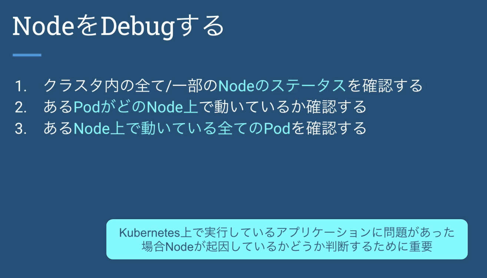

# node



### 準備

kubernetes-practice もしくは kubernetes-basics の 07-debug-kubernetes の階層に行き kubectl apply -f . を打つ

### 確認

- pod がどの node に乗っているのかを見たいときはこれ。

```bash
$ kubectl get po -o wide                                                     ○ docker-desktop
NAME      READY   STATUS             RESTARTS   AGE     IP          NODE             NOMINATED NODE   READINESS GATES
nginx-1   0/1     ImagePullBackOff   0          4m59s   10.1.2.72   docker-desktop   <none>           <none>
nginx-2   0/1     Pending            0          4m59s   <none>      <none>           <none>           <none>
nginx-3   1/1     Running            0          4m59s   10.1.2.70   docker-desktop   <none>           <none>
```

- 色々見たいときは describe

```bash
$ kubectl describe no                                                                                                                  ○ docker-desktop
Name:               docker-desktop
Roles:              control-plane,master
Labels:             beta.kubernetes.io/arch=arm64
                    beta.kubernetes.io/os=linux
                    kubernetes.io/arch=arm64
                    kubernetes.io/hostname=docker-desktop
                    kubernetes.io/os=linux
                    node-role.kubernetes.io/control-plane=
                    node-role.kubernetes.io/master=
                    node.kubernetes.io/exclude-from-external-load-balancers=
Annotations:        kubeadm.alpha.kubernetes.io/cri-socket: /var/run/dockershim.sock
                    node.alpha.kubernetes.io/ttl: 0
                    volumes.kubernetes.io/controller-managed-attach-detach: true
CreationTimestamp:  Sun, 31 Oct 2021 12:36:01 +0900
Taints:             <none>
Unschedulable:      false
Lease:
  HolderIdentity:  docker-desktop
  AcquireTime:     <unset>
  RenewTime:       Wed, 12 Jan 2022 22:46:12 +0900
Conditions:
  Type             Status  LastHeartbeatTime                 LastTransitionTime                Reason                       Message
  ----             ------  -----------------                 ------------------                ------                       -------
  MemoryPressure   False   Wed, 12 Jan 2022 22:46:12 +0900   Sun, 31 Oct 2021 12:35:58 +0900   KubeletHasSufficientMemory   kubelet has sufficient memory available
  DiskPressure     False   Wed, 12 Jan 2022 22:46:12 +0900   Sun, 31 Oct 2021 12:35:58 +0900   KubeletHasNoDiskPressure     kubelet has no disk pressure
  PIDPressure      False   Wed, 12 Jan 2022 22:46:12 +0900   Sun, 31 Oct 2021 12:35:58 +0900   KubeletHasSufficientPID      kubelet has sufficient PID available
  Ready            True    Wed, 12 Jan 2022 22:46:12 +0900   Sun, 31 Oct 2021 12:36:01 +0900   KubeletReady                 kubelet is posting ready status
Addresses:
  InternalIP:  192.168.65.4
  Hostname:    docker-desktop
Capacity:
  cpu:                4
  ephemeral-storage:  61255492Ki
  hugepages-1Gi:      0
  hugepages-2Mi:      0
  hugepages-32Mi:     0
  hugepages-64Ki:     0
  memory:             2036540Ki
  pods:               110
Allocatable:
  cpu:                4
  ephemeral-storage:  56453061334
  hugepages-1Gi:      0
  hugepages-2Mi:      0
  hugepages-32Mi:     0
  hugepages-64Ki:     0
  memory:             1934140Ki
  pods:               110
System Info:
  Machine ID:                 49233c6f-970c-4fac-ac7c-0f714adc258d
  System UUID:                49233c6f-970c-4fac-ac7c-0f714adc258d
  Boot ID:                    513888a1-e05b-4029-9dc9-1e6549ae4191
  Kernel Version:             5.10.47-linuxkit
  OS Image:                   Docker Desktop
  Operating System:           linux
  Architecture:               arm64
  Container Runtime Version:  docker://20.10.10
  Kubelet Version:            v1.21.2
  Kube-Proxy Version:         v1.21.2
Non-terminated Pods:          (14 in total)
  Namespace                   Name                                          CPU Requests  CPU Limits  Memory Requests  Memory Limits  Age
  ---------                   ----                                          ------------  ----------  ---------------  -------------  ---
  default                     nginx-1                                       0 (0%)        0 (0%)      0 (0%)           0 (0%)         34m
  default                     nginx-3                                       0 (0%)        0 (0%)      0 (0%)           0 (0%)         34m
  kube-system                 coredns-558bd4d5db-d6dhr                      100m (2%)     0 (0%)      70Mi (3%)        170Mi (9%)     73d
  kube-system                 coredns-558bd4d5db-mjfq5                      100m (2%)     0 (0%)      70Mi (3%)        170Mi (9%)     73d
  kube-system                 etcd-docker-desktop                           100m (2%)     0 (0%)      100Mi (5%)       0 (0%)         73d
  kube-system                 kube-apiserver-docker-desktop                 250m (6%)     0 (0%)      0 (0%)           0 (0%)         73d
  kube-system                 kube-controller-manager-docker-desktop        200m (5%)     0 (0%)      0 (0%)           0 (0%)         73d
  kube-system                 kube-proxy-qgjks                              0 (0%)        0 (0%)      0 (0%)           0 (0%)         73d
  kube-system                 kube-scheduler-docker-desktop                 100m (2%)     0 (0%)      0 (0%)           0 (0%)         73d
  kube-system                 storage-provisioner                           0 (0%)        0 (0%)      0 (0%)           0 (0%)         73d
  kube-system                 vpnkit-controller                             0 (0%)        0 (0%)      0 (0%)           0 (0%)         73d
  kubernetes-dashboard        dashboard-metrics-scraper-5594697f48-v7cjw    0 (0%)        0 (0%)      0 (0%)           0 (0%)         26d
  kubernetes-dashboard        kubernetes-dashboard-57c9bfc8c8-jdfjg         0 (0%)        0 (0%)      0 (0%)           0 (0%)         26d
  test                        nginx-4                                       0 (0%)        0 (0%)      0 (0%)           0 (0%)         11d
Allocated resources:
  (Total limits may be over 100 percent, i.e., overcommitted.)
  Resource           Requests     Limits
  --------           --------     ------
  cpu                850m (21%)   0 (0%)
  memory             240Mi (12%)  340Mi (18%)
  ephemeral-storage  0 (0%)       0 (0%)
  hugepages-1Gi      0 (0%)       0 (0%)
  hugepages-2Mi      0 (0%)       0 (0%)
  hugepages-32Mi     0 (0%)       0 (0%)
  hugepages-64Ki     0 (0%)       0 (0%)
Events:              <none>
```

### よく見る項目

- Non-terminated Pods
  - どの pod がこの node に乗っているかを見る
    - 決まった node しか乗らない or 全 node に乗せなければならないやつ(監視系のやつ)が pending 担っている際は、だいたい cpu や memory が 100% になっているパターン。その際はここで cpu や memory を食っている pod を見つけて他の node に移動させたりする。
- Allocated resources
  - cpu と memory のリクエストを見る（リクエストが 100％ を超えるとその node に pod は乗らなくなる。）
    - → 実際に使用されている cpu と memory は関係ない！！
- Taints
  - taint が付いていると 容認されていなければ pod は乗らない
  - 詳しくは Taints と Tolerations を参照
