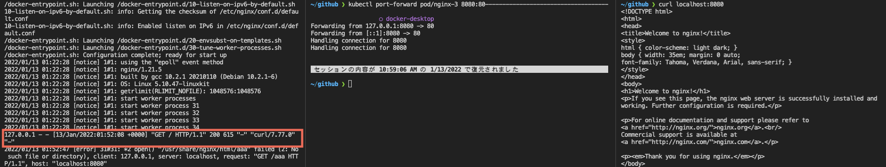
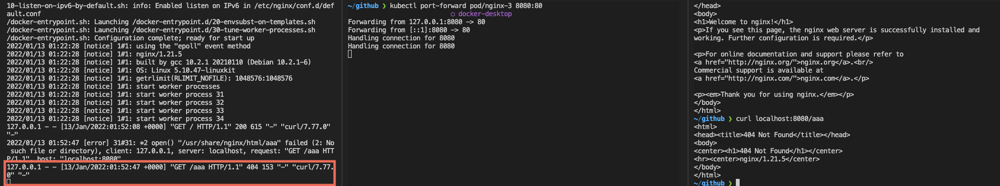

# pod

- ラベル表示（node もできる）

```bash
$ kubectl get po --show-labels                                               ○ docker-desktop
NAME      READY   STATUS         RESTARTS   AGE     LABELS
nginx-1   0/1     ErrImagePull   0          3m37s   run=nginx
nginx-2   0/1     Pending        0          3m37s   run=nginx
nginx-3   1/1     Running        0          3m37s   run=nginx
```

- ラベル指定で pod を取得（node もできる）

```bash
$ kubectl get po -l run=nginx                                                                                                         
NAME      READY   STATUS             RESTARTS   AGE
nginx-1   0/1     ImagePullBackOff   0          23m
nginx-2   0/1     Pending            0          23m
nginx-3   1/1     Running            0          23m

$ kubectl get po --selector run=nginx                                                                                                 
NAME      READY   STATUS             RESTARTS   AGE
nginx-1   0/1     ImagePullBackOff   0          23m
nginx-2   0/1     Pending            0          23m
nginx-3   1/1     Running            0          23m
```

- よく使う namespace 指定

2つめのコマンドみたいなパターンでよく特定のサービス名のついた namespace を取得してくることが多い。

```bash
$ kubectl get po -n default                                                                                                        
NAME      READY   STATUS             RESTARTS   AGE
nginx-1   0/1     ImagePullBackOff   0          23m
nginx-2   0/1     Pending            0          23m
nginx-3   1/1     Running            0          23m

$ kubectl get po -n kubernetes-dashboard                                                                                               
NAME                                         READY   STATUS    RESTARTS   AGE
dashboard-metrics-scraper-5594697f48-v7cjw   1/1     Running   15         26d
kubernetes-dashboard-57c9bfc8c8-jdfjg        1/1     Running   16         26d

# 単体取得だとこれ。describe したいときによく使う。
$ kubectl get po kube-scheduler-docker-desktop -n kube-system                                                                         
NAME                            READY   STATUS    RESTARTS   AGE
kube-scheduler-docker-desktop   1/1     Running   59         73d
```

- Outputを変えて詳細を表示。jsou や yaml も可能。（node もできる）

```bash
$ kubectl get po -o wide                                                    
NAME      READY   STATUS             RESTARTS   AGE     IP          NODE             NOMINATED NODE   READINESS GATES
nginx-1   0/1     ImagePullBackOff   0          4m59s   10.1.2.72   docker-desktop   <none>           <none>
nginx-2   0/1     Pending            0          4m59s   <none>      <none>           <none>           <none>
nginx-3   1/1     Running            0          4m59s   10.1.2.70   docker-desktop   <none>           <none>
```

- yaml は 取得してきたものをそのまま yaml ファイルに格納して使うこともできる

```bash
$ kubectl get po nginx-1 -o yaml > test.yaml
```

- jq や jsonpath を使って、ほしいパラメーターを取得。

```bash
$ kubectl get po -o json | jq -r '.items[].metadata.name'
nginx-1
nginx-2
nginx-3

$ kubectl get pod -o jsonpath='{.items[*].metadata.name}'
nginx-1 nginx-2 nginx-3
```

---

## debug

### 準備

kubernetes-practice もしくは kubernetes-basics の 07-debug-kubernetes の階層に行き kubectl apply -f . を打つ

```bash
$ kubectl get po                                                          
NAME      READY   STATUS             RESTARTS   AGE
nginx-1   0/1     ImagePullBackOff   0          18m
nginx-2   0/1     Pending            0          18m
nginx-3   1/1     Running            0          18m
```

```bash
$ kubectl get no                                                           
NAME             STATUS   ROLES                  AGE   VERSION
docker-desktop   Ready    control-plane,master   73d   v1.21.2
```

### nginx-1 確認

- describe

pod が正常かどうかを判断するときは、まず describe をする。

そして Events をチェックする

```bash
$ kubectl describe po nginx-1
Name:         nginx-1
Namespace:    default
Priority:     0
Node:         docker-desktop/192.168.65.4
Start Time:   Thu, 13 Jan 2022 10:22:19 +0900
Labels:       run=nginx
Annotations:  <none>
Status:       Pending
IP:           10.1.2.82
IPs:
  IP:  10.1.2.82
Containers:
  nginx:
    Container ID:   
    Image:          wrong-nginx
    Image ID:       
    Port:           <none>
    Host Port:      <none>
    State:          Waiting
      Reason:       ImagePullBackOff
    Ready:          False
    Restart Count:  0
    Environment:    <none>
    Mounts:
      /var/run/secrets/kubernetes.io/serviceaccount from kube-api-access-4fbzk (ro)
Conditions:
  Type              Status
  Initialized       True 
  Ready             False 
  ContainersReady   False 
  PodScheduled      True 
Volumes:
  kube-api-access-4fbzk:
    Type:                    Projected (a volume that contains injected data from multiple sources)
    TokenExpirationSeconds:  3607
    ConfigMapName:           kube-root-ca.crt
    ConfigMapOptional:       <nil>
    DownwardAPI:             true
QoS Class:                   BestEffort
Node-Selectors:              <none>
Tolerations:                 node.kubernetes.io/not-ready:NoExecute op=Exists for 300s
                             node.kubernetes.io/unreachable:NoExecute op=Exists for 300s
Events:
  Type     Reason     Age                    From               Message
  ----     ------     ----                   ----               -------
  Normal   Scheduled  5m                     default-scheduler  Successfully assigned default/nginx-1 to docker-desktop
  Normal   Pulling    3m15s (x4 over 4m59s)  kubelet            Pulling image "wrong-nginx"
  Warning  Failed     3m12s (x4 over 4m56s)  kubelet            Failed to pull image "wrong-nginx": rpc error: code = Unknown desc = Error response from daemon: pull access denied for wrong-nginx, repository does not exist or may require 'docker login': denied: requested access to the resource is denied
  Warning  Failed     3m12s (x4 over 4m56s)  kubelet            Error: ErrImagePull
  Warning  Failed     3m (x6 over 4m55s)     kubelet            Error: ImagePullBackOff
  Normal   BackOff    2m48s (x7 over 4m55s)  kubelet            Back-off pulling image "wrong-nginx"
```

今回は "wrong-nginx" を pull しようとしたができなかったとある。

- -o yaml

他の方法として kubectl get po <pod> -o yaml コマンドを打つ

すると status のなかの containerStatuses を見ると原因が書いてある。

```bash
containerStatuses:
  - image: wrong-nginx
    imageID: ""
    lastState: {}
    name: nginx
    ready: false
    restartCount: 0
    started: false
    state:
      waiting:
        message: Back-off pulling image "wrong-nginx"
        reason: ImagePullBackOff
```

---

### nginx-2 確認

nginx-2 中身

```bash
apiVersion: v1
kind: Pod
metadata:
  creationTimestamp: null
  labels:
    run: nginx
  name: nginx-2
spec:
  containers:
  - image: nginx
    name: nginx
    resources: {}
  dnsPolicy: ClusterFirst
  restartPolicy: Always
  nodeSelector:
    nodeType: test
status: {}
```

- とりあえず describe してみる

```bash
$ kubectl describe po nginx-2
```

```bash
Events:
  Type     Reason            Age                 From               Message
  ----     ------            ----                ----               -------
  Warning  FailedScheduling  11s (x16 over 15m)  default-scheduler  0/1 nodes are available: 1 node(s) didn't match Pod's node affinity/selector.
```

nginx-2 の中身を見ると、nodeType: test とあるが、そんな node はない

確認方法としては —selector を使って絞る。

```bash
$ kubectl get no --selector nodeType=test                                  
No resources found
```

---

### nginx-3 確認

log を見てみる

```bash
$ kubectl logs nginx-3                                                       ○ docker-desktop
/docker-entrypoint.sh: /docker-entrypoint.d/ is not empty, will attempt to perform configuration
/docker-entrypoint.sh: Looking for shell scripts in /docker-entrypoint.d/
/docker-entrypoint.sh: Launching /docker-entrypoint.d/10-listen-on-ipv6-by-default.sh
10-listen-on-ipv6-by-default.sh: info: Getting the checksum of /etc/nginx/conf.d/default.conf
10-listen-on-ipv6-by-default.sh: info: Enabled listen on IPv6 in /etc/nginx/conf.d/default.conf
/docker-entrypoint.sh: Launching /docker-entrypoint.d/20-envsubst-on-templates.sh
/docker-entrypoint.sh: Launching /docker-entrypoint.d/30-tune-worker-processes.sh
/docker-entrypoint.sh: Configuration complete; ready for start up
2022/01/13 01:22:28 [notice] 1#1: using the "epoll" event method
2022/01/13 01:22:28 [notice] 1#1: nginx/1.21.5
2022/01/13 01:22:28 [notice] 1#1: built by gcc 10.2.1 20210110 (Debian 10.2.1-6) 
2022/01/13 01:22:28 [notice] 1#1: OS: Linux 5.10.47-linuxkit
2022/01/13 01:22:28 [notice] 1#1: getrlimit(RLIMIT_NOFILE): 1048576:1048576
2022/01/13 01:22:28 [notice] 1#1: start worker processes
2022/01/13 01:22:28 [notice] 1#1: start worker process 31
2022/01/13 01:22:28 [notice] 1#1: start worker process 32
2022/01/13 01:22:28 [notice] 1#1: start worker process 33
2022/01/13 01:22:28 [notice] 1#1: start worker process 34
```

 

- option
    - -f : ログが来たときにシームレスに出てくる
    - —tail=1 : 末尾何行取得するか
    - -c : コンテナ指定
    - -n : namespace 指定
    

```bash
$ kubectl logs nginx-3 -f
```

```bash
$ kubectl port-forward pod/nginx-3 8080:80
```

下のコマンドを打つと200が帰ってきているのがわかる

```bash
$ curl localhost:8080
```



下のやつを打つと404エラーが出ているのがわかる

```bash
curl localhost:8080/aaa
```


