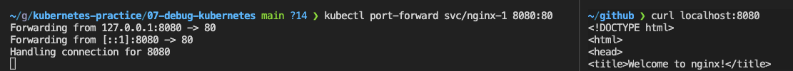
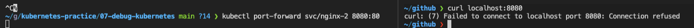

# service

## service が使えない状態のときの原因

- セレクターにマッチする pod が存在するかどうか
- マッチした pod は正常に動いているか
- port は正しいか

kubernetes 上で実行しているアプリケーションの依存先へ接続できない場合に service の確認が必要となる

service が使えるかどうか

```bash
$ kubectl port-forward svc/nginx-1 8080:80
```



```bash
$ kubectl get ep nginx-1
NAME      ENDPOINTS      AGE
nginx-1   10.1.2.91:80   5m53s
```

```bash
$ ubectl describe ep nginx-1
Name:         nginx-1
Namespace:    default
Labels:       run=nginx
Annotations:  <none>
Subsets:
  Addresses:          10.1.2.91
  NotReadyAddresses:  10.1.2.92
  Ports:
    Name  Port  Protocol
    ----  ----  --------
    80    80    TCP

Events:  <none>
```

ラベルで指定できるので例えば

```bash
$ kubectl get po -l run=nginx -o wide
NAME      READY   STATUS             RESTARTS   AGE   IP          NODE             NOMINATED NODE   READINESS GATES
nginx-1   0/1     ImagePullBackOff   0          13m   10.1.2.92   docker-desktop   <none>           <none>
nginx-2   0/1     Pending            0          13m   <none>      <none>           <none>           <none>
nginx-3   1/1     Running            0          13m   10.1.2.91   docker-desktop   <none>           <none>
```

立ち上がっていないのが NotReadyAddresses に書かれる

-o wide により IP の情報も見て取れる。しっかり nginx-1 が立ち上がってないのがわかる。

service nginx-1 を見に行くかもしくは

```yaml
$ kubectl get svc nginx-1 -o wide
```

を打って中身を見る

service-nginx-1.yaml

```yaml
apiVersion: v1
kind: Service
metadata:
  creationTimestamp: null
  labels:
    run: nginx
  name: nginx-1
spec:
  ports:
    - name: '80'
      port: 80
      protocol: TCP
      targetPort: 80
  selector:
    run: nginx
  type: ClusterIP
status:
  loadBalancer: {}
```

port が 80 になっている

```yaml
$ kubectl describe ep nginx-2                                                                ○ docker-desktop
Name:         nginx-2
Namespace:    default
Labels:       run=nginx
Annotations:  endpoints.kubernetes.io/last-change-trigger-time: 2022-01-14T12:04:00Z
Subsets:
Events:  <none>
```

subset が空である。

```yaml
$ kubectl get ep nginx-2                                                                     ○ docker-desktop
NAME      ENDPOINTS   AGE
nginx-2   <none>      16m
```

endpoint も空

port-forward しても何も起きず



ということで、マッチしたラベルがあるかどうか調べるために、service nginx-2 を見に行くかもしくは

```yaml
$ kubectl get svc nginx-2 -o wide
```

を打って中身を見る

```yaml
apiVersion: v1
kind: Service
metadata:
  creationTimestamp: null
  labels:
    run: nginx
  name: nginx-2
spec:
  ports:
    - name: '80'
      port: 80
      protocol: TCP
      targetPort: 80
  selector:
    run: nonexisting
  type: ClusterIP
status:
  loadBalancer: {}
```

selector のとこを見ると run: nonexisting となっている。

```yaml
$ kubectl get po -l run=nonexisting
No resources found in default namespace.
```

nonexisting ⇒ nginx として直すとうまくいく
